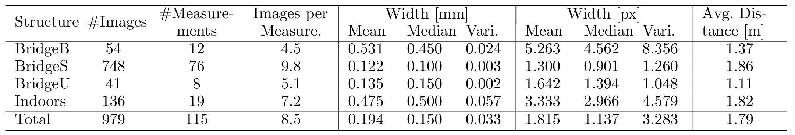
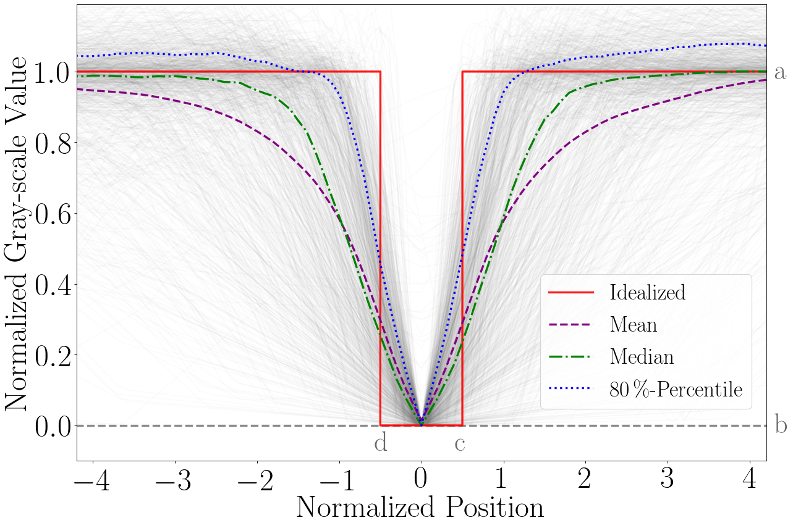
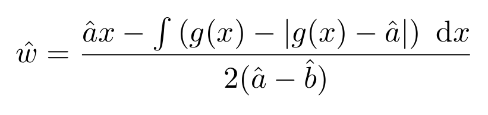
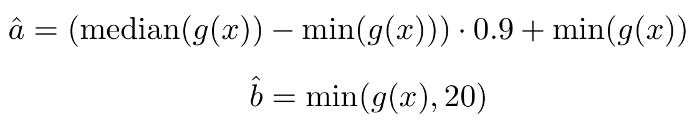
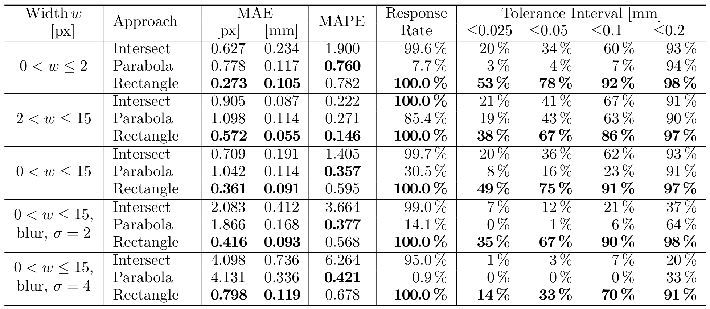

# Crack Width Estimation using <br> Rectangle Transform

This repository contains the code that was used for the publication:

**Model-based Crack Width Estimation using Rectangle Transform** <br>
by *Christian Benz* and *Volker Rodehorst*<br>
at the *International Conference on Machine Vision Applications* [MVA](http://www.mva-org.jp/mva2021/).


## Dataset
The dataset was captured at four sites. For details please refer to [1].

<br>

<figure>
  
  <figcaption>Table 1: Overview of the available data and the respective crack widths. From [1].</figcaption>
</figure> 

<br><br>

<figure>
  
  <figcaption>Figure 1: Normalized gray-scale profiles of cracks. From [1].</figcaption>
</figure> 

## Rectangle Transform
The conceptual basis is formed by the *idealized crack profile* (see above, red line). For details please refer to [1]. The estimated width can be computed by:




with 




The core functionality is to be found in utils:

```python
def rectangle_transform(prof_line, base=20, height=0.9):
    # determine relevant measures
    medi = np.median(prof_line)
    mini = np.min(prof_line[10:20])
    hori = (medi - mini) * height + mini
    base = min(base, mini)

    # determine width
    x = np.arange(0, 30.1, 0.1)
    gx = np.interp(x, np.arange(0, 30), prof_line)
    a = np.full((len(x)), hori)
    b = np.full((len(x)), base)

    # apply equation from paper
    nom = a[0] * 30 - np.trapz(gx - np.abs(gx - a), x)
    w = nom / (2 * (a[0] - b[0]))

    return w
```


## Evaluation
For details on the evaluation, please refer to [1].

<br>

<figure>
  
  <figcaption>Table 2: Overview of the results for different approaches and crack widths. From [1].</figcaption>
</figure> 

<br><br>

<figure>
  
  <figcaption>Figure 3: Overview of the performance. From [1].</figcaption>
</figure> 


## Reference

Please cite the work accordingly:

```
@inproceedings{benz2021rectangle,
	title={Model-based Crack Width Estimation using Rectangle Transform},
	author={Benz, Christian and Rodehorst, Volker},
	booktitle={2021 17th International Conference on Machine Vision Applications (MVA)},
	year={2021}
}
```

[1] C. Benz and V. Rodehorst, “Model-based crack width estimation using
rectangle transform,” in 2021 17th International Conference on Machine
Vision Applications (MVA), 2021.
